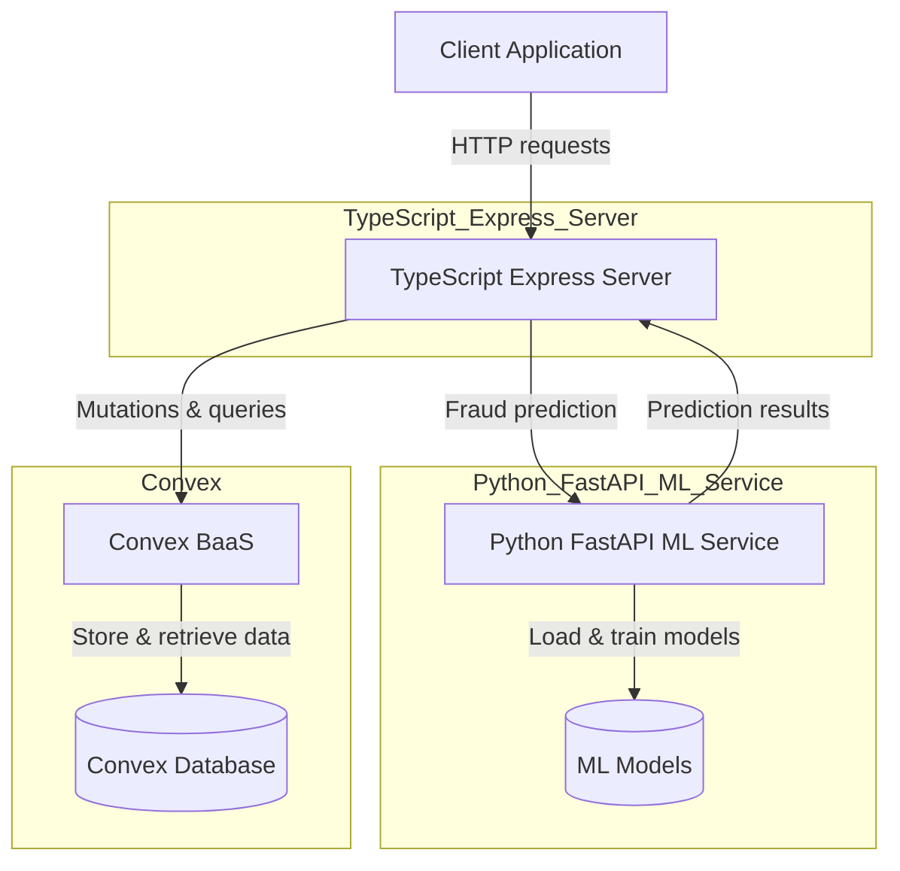

# HackMIT 2024 API - Fraud Detection and Transaction Management

## 🌟 Overview

This monorepo project, developed during HackMIT 2024, provides a robust backend infrastructure for managing user transactions and detecting potential fraud. It leverages a dual-stack approach, combining a Python-based FastAPI service for machine learning-driven fraud prediction with a TypeScript-based Express.js server for API routing and interaction with a Convex.dev backend as a service (BaaS) for data persistence. This setup ensures both high performance for ML inferences and efficient, scalable data management.

This repository is a fork of an original project, enhanced with custom modifications and extended functionalities, particularly in the fraud detection capabilities.

## ✨ Features

-   **User Management**: API endpoints for creating, retrieving, updating, and deleting user records.
-   **Transaction Management**: Comprehensive API for handling transaction creation, retrieval (all, by ID, by user), updates, and deletions.
-   **Real-time Fraud Prediction**: Integrates multiple machine learning models (Logistic Regression, TensorFlow, LLaMA-based analysis) to assess transaction legitimacy.
-   **Asynchronous Fraud Processing**: Transactions are initially stored temporarily, and fraud prediction runs in the background, updating the transaction status once completed.
-   **Scalable Backend**: Utilizes Convex.dev for a reactive, serverless database and function platform, simplifying data synchronization and state management.
-   **Dockerized Deployment**: Both the Python ML API and the TypeScript server are containerized for consistent and isolated deployment.
-   **API Gateway/Orchestration**: The TypeScript Express server acts as an orchestrator, handling incoming requests, interacting with Convex, and delegating fraud prediction to the Python FastAPI service.
-   **Comprehensive Error Handling & Rate Limiting**: Implements robust error handling and API rate limiting for security and stability.

## 🚀 Architecture

The project follows a microservices-inspired architecture:

1.  **TypeScript Express.js Server (Frontend-facing API)**:
    *   Handles all incoming HTTP requests for user and transaction management.
    *   Acts as an API gateway, routing requests to appropriate Convex.dev functions.
    *   Orchestrates the fraud detection workflow:
        *   Stores initial transaction data temporarily in Convex.
        *   Calls the Python FastAPI service for fraud prediction.
        *   Updates the transaction in Convex with fraud analysis results.
    *   Implements CORS, rate limiting, and centralized error handling.
    *   Deployed as a Node.js application.

2.  **Python FastAPI Service (ML-driven Fraud Prediction)**:
    *   Exposes a `/api/v1/predict_fraud` endpoint.
    *   Integrates three fraud detection mechanisms:
        *   **Logistic Regression**: A traditional statistical model for baseline prediction.
        *   **TensorFlow Model**: A neural network for more complex pattern recognition.
        *   **LLaMA Integration**: Leverages `transformers` library (using a GPT-2 model as a placeholder for LLaMA, demonstrating the capability) for natural language understanding of transaction details to provide explanations.
    *   The models are trained using mock data (e.g., `X_train.csv`, `y_train.csv`).
    *   Deployed as a Python FastAPI application, containerized with Docker.

3.  **Convex.dev (Backend as a Service)**:
    *   Provides a reactive, serverless database for `users`, `transactions`, and `tempTransactions`.
    *   Hosts server-side functions (mutations and queries) for data operations.
    *   Enables real-time data updates and synchronization.


**Architectural Diagram**: 

## 🏗️ Project Structure

```
hackmit-2024-api/
├── api/                  # Python FastAPI service for ML models
│   ├── app/              # FastAPI application logic
│   │   ├── db/           # (Currently empty, indicating no direct DB usage from FastAPI)
│   │   ├── ml/           # Machine Learning models and integration (Logistic Regression, LLaMA, TensorFlow)
│   │   ├── models/       # Pydantic models for API request/response
│   │   ├── routers/      # FastAPI endpoint definitions (e.g., transactions)
│   │   └── services/     # Mock data generation and transaction service logic
│   ├── data/             # Placeholder for ML training data (CSV, JSON)
│   ├── tests/            # Pytest suite for FastAPI service
│   ├── Dockerfile        # Dockerfile for containerizing the FastAPI app
│   ├── main.py           # Main FastAPI application entry point
│   ├── requirements.txt  # Python dependencies
│   └── vercel.json       # Vercel configuration for Python deployment
├── server/               # TypeScript Express.js server for API orchestration
│   ├── convex/           # Convex.dev backend configuration, schema, and functions
│   │   ├── _generated/   # Generated Convex types and API utilities
│   │   ├── http.ts       # Convex HTTP actions (e.g., direct API routes)
│   │   ├── schema.ts     # Convex database schema definition
│   │   ├── transactions.ts # Convex functions for transaction management
│   │   └── users.ts      # Convex functions for user management
│   ├── errors/           # Custom error classes
│   ├── middlewares/      # Express middleware (error handling, async handlers)
│   ├── routes/           # Base router for Express (currently not fully utilized but present)
│   ├── env.d.ts          # Environment variable declarations
│   ├── server.ts         # Main Express.js server application entry point
│   ├── package.json      # Node.js dependencies and scripts
│   ├── tsconfig.json     # TypeScript configuration
│   └── Dockerfile        # Dockerfile for containerizing the Express app
└── README.md             # This file
```

## 🚀 Tech Stack

**Python FastAPI Service:**
-   **Language**: Python 3.9+
-   **Framework**: FastAPI
-   **ML Libraries**: `scikit-learn`, `tensorflow`, `torch`, `transformers`, `numpy`, `pandas`
-   **Database ORM**: `sqlalchemy` (though `api/app/db/database.py` is empty, indicating a shift from direct RDBMS in this part)
-   **HTTP Client**: `httpx` (for testing)
-   **Containerization**: Docker

**TypeScript Express.js Server:**
-   **Language**: TypeScript
-   **Runtime**: Node.js
-   **Framework**: Express.js
-   **Backend as a Service (BaaS)**: Convex.dev
-   **HTTP Client**: `axios`, `fetch` (native)
-   **Security**: `express-rate-limit`, `cors`, `bcrypt` (though not directly used in provided server.ts for user auth)
-   **Containerization**: Docker
-   **Development Tools**: `nodemon`, `ts-node`, `vitest`, `@biomejs/biome` (linter/formatter)

## 📦 Installation (Local Development)

### Prerequisites

-   Node.js (v18+) & npm
-   Python (v3.9+) & pip
-   Docker (optional, but recommended for consistent setup)
-   Convex CLI (`npm i -g convex`)

### Steps

1.  **Clone the repository:**
    ```bash
    git clone https://github.com/WomB0ComB0/hackmit-2024-api.git
    cd hackmit-2024-api
    ```

2.  **Setup Python FastAPI Service (`api` directory):**
    ```bash
    cd api
    # Create a virtual environment (recommended)
    python -m venv venv
    source venv/bin/activate # On Windows: .\venv\Scripts\activate
    pip install -r requirements.txt
    # Generate mock training data (if not already present)
    # python app/services/mock_data_generator.py
    cd ..
    ```

3.  **Setup TypeScript Express.js Server (`server` directory):**
    ```bash
    cd server
    npm install
    # Set up Convex.dev
    # Initialize a new Convex project if you don't have one linked
    # convex init
    # Configure your CONVEX_URL in a .env file (or as an environment variable)
    # CONVEX_URL=YOUR_CONVEX_DEPLOYMENT_URL
    cd ..
    ```
    *Note: You'll need to create a Convex deployment and obtain its URL to connect the `server` to it.*

## 🏃‍♂️ Running the Application

### 1. Start Convex.dev Development Environment

Navigate to the `server` directory and run:
```bash
cd server
convex dev
# This will start the Convex development server and sync your schema/functions.
# Keep this running in a separate terminal.
```

### 2. Start Python FastAPI Service

Navigate to the `api` directory and run:
```bash
cd api
source venv/bin/activate # Activate virtual environment if you created one
uvicorn main:app --host 0.0.0.0 --port 8080 --reload
# This will start the FastAPI server on http://localhost:8080
# Keep this running in a separate terminal.
```

### 3. Start TypeScript Express.js Server

Navigate to the `server` directory and run:
```bash
cd server
npm run dev
# This will start the Express.js server in development mode on http://localhost:3000
```
*Note: Ensure the `CONVEX_URL` environment variable is correctly set in your `server/.env` file or directly in your environment for the TypeScript server to connect to Convex.*

## 🐳 Docker Deployment

Both services can be built and run using Docker.

### Building Docker Images

```bash
# Build FastAPI image
docker build -t hackmit-2024-api-ml:latest ./api

# Build Express.js server image
docker build -t hackmit-2024-api-server:latest ./server
```

### Running Docker Containers (Example with `docker-compose`)

For a full local Docker setup, you would typically use `docker-compose`. Here's a conceptual `docker-compose.yml`:

```yaml
version: '3.8'
services:
  ml-api:
    build:
      context: ./api
      dockerfile: Dockerfile
    ports:
      - "8080:8080"
    environment:
      # Add any environment variables required by your FastAPI app
      - HUGGING_FACE_API_TOKEN=your_hf_token # if using LLaMA/GPT-2
    networks:
      - app-network

  main-server:
    build:
      context: ./server
      dockerfile: Dockerfile
    ports:
      - "3000:3000"
    environment:
      - NODE_ENV=development
      - CONVEX_URL=YOUR_CONVEX_DEPLOYMENT_URL # Replace with your Convex URL
      # Make sure this server can reach the ML API
      - ML_API_URL=http://ml-api:8080/api/v1/predict_fraud 
    networks:
      - app-network
    depends_on:
      - ml-api

networks:
  app-network:
    driver: bridge
```
*Note: You would need to ensure `ML_API_URL` is configured in `server/server.ts` to use `process.env.ML_API_URL` if running in Docker, or ensure `predictFraud` targets the correct Docker service name if the `fetch` call is hardcoded.*

## ⚙️ API Endpoints

The TypeScript Express server exposes the following endpoints (base URL for local development: `http://localhost:3000`):

### Health Check

```bash
curl http://localhost:3000/health
# Expected Response: OK
```

### User Routes

-   **Create User**: `POST /api/users`
    ```bash
    curl -X POST http://localhost:3000/api/users \
      -H "Content-Type: application/json" \
      -d '{"name": "Jane Doe", "email": "jane@example.com", "id": "auth0|12345"}'
    ```
-   **Get User**: `GET /api/users/{USER_ID}`
    ```bash
    curl http://localhost:3000/api/users/auth0|12345
    ```
-   **Update User**: `PUT /api/users/{USER_ID}`
    ```bash
    curl -X PUT http://localhost:3000/api/users/auth0|12345 \
      -H "Content-Type: application/json" \
      -d '{"name": "Jane Updated", "email": "jane.updated@example.com"}'
    ```
-   **Delete User**: `DELETE /api/users/{USER_ID}`
    ```bash
    curl -X DELETE http://localhost:3000/api/users/auth0|12345
    ```
-   **Head User**: `HEAD /api/users`
-   **Options User**: `OPTIONS /api/users`

### Transaction Routes

-   **Create Transaction (Initiate Fraud Prediction)**: `POST /api/transactions`
    ```bash
    curl -X POST http://localhost:3000/api/transactions \
      -H "Content-Type: application/json" \
      -d '{
        "userId": "auth0|12345",
        "amount": 100.50,
        "productCategory": "Electronics",
        "customerLocation": "New York",
        "accountAgeDays": 365,
        "transactionDate": "2023-09-15T12:00:00Z"
      }'
    # Returns a tempId. Fraud prediction happens in the background.
    ```
-   **Finalize Transaction**: `POST /api/transactions/finalize`
    ```bash
    curl -X POST http://localhost:3000/api/transactions/finalize \
      -H "Content-Type: application/json" \
      -d '{"tempId": "TEMP_TRANSACTION_ID_FROM_PREVIOUS_STEP"}'
    # Moves the transaction from tempTransactions to transactions table, including fraud prediction results.
    ```
-   **Get All Transactions**: `GET /api/transactions`
-   **Get Transaction by ID**: `GET /api/transactions/{TRANSACTION_ID}`
-   **Get Transactions by User ID**: `GET /api/transactions/user/{USER_ID}`
-   **Update Transaction**: `PUT /api/transactions/{TRANSACTION_ID}`
    ```bash
    curl -X PUT http://localhost:3000/api/transactions/TRANSACTION_ID \
      -H "Content-Type: application/json" \
      -d '{
        "amount": 150.75,
        "productCategory": "Clothing",
        "customerLocation": "Los Angeles",
        "accountAgeDays": 400,
        "transactionDate": "2023-09-16T14:30:00Z"
      }'
    ```
-   **Delete Transaction**: `DELETE /api/transactions/{TRANSACTION_ID}`
-   **Head Transaction**: `HEAD /api/transactions`
-   **Options Transaction**: `OPTIONS /api/transactions`

## 🔧 Development

### Python FastAPI Service (`api`):

-   **Testing**: `pytest`
    ```bash
    cd api
    source venv/bin/activate
    pytest tests/
    ```
-   **Linting**: `pylint` (configured in `.pylintrc`)

### TypeScript Express.js Server (`server`):

-   **Development Mode**: `npm run dev` (uses `nodemon` for live reloading)
-   **Building**: `npm run build` (transpiles TypeScript to JavaScript)
-   **Testing**: `vitest`
    ```bash
    cd server
    npm test          # Run all tests once
    npm run test:watch # Run tests in watch mode
    ```
-   **Linting & Formatting**: `@biomejs/biome`
    ```bash
    cd server
    npm run lint
    ```
-   **Convex.dev Development**: `convex dev` (syncs schema and functions, watches for changes)

## 📈 Project Status

-   **Created**: June 7, 2025 (Initial Hackathon Project)
-   **Last Updated**: 32 days ago
-   **Languages**: TypeScript, Python
-   **Stars**: 1 (on fork)
-   **Forks**: 0 (on fork)

## 🤝 Contributing

This is a hackathon project fork. Contributions are welcome! Feel free to explore the code, suggest improvements, or submit pull requests.

## 📄 License

This repository is licensed under the MIT License, inherited from the original project. See the `server/LICENSE` file for details.

## 🔗 Original Project

This repository is forked from [ZachMckay47/hackmit-2024-api](https://github.com/ZachMckay47/hackmit-2024-api).
